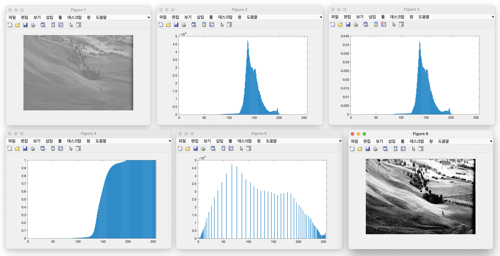

### Histogram Equalization for Image Contrast Enhancement

- **assignment_01.m**: main script
- **my_histogram.m**: the function that generates a histogram of an image
- **cumulative_hist.m**: the function that generates the cumulative histogram
- **my_histeq.m**: the function that generates the equalized histogram and mapping table
- **my_contrastEnhance.m**: the function that generates the contrast enhanced image
