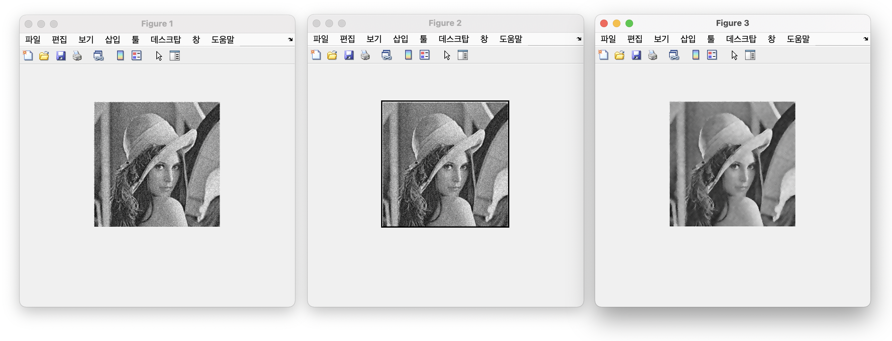

### Bilateral Image Filtering

1. Define the spatial gaussisan filter.
2. Add zero padding so that the filtered image is of the same size as the input image.
3. Apply bilateral filtering on the image.
4. Display the original image, padded image, and filtered image.
