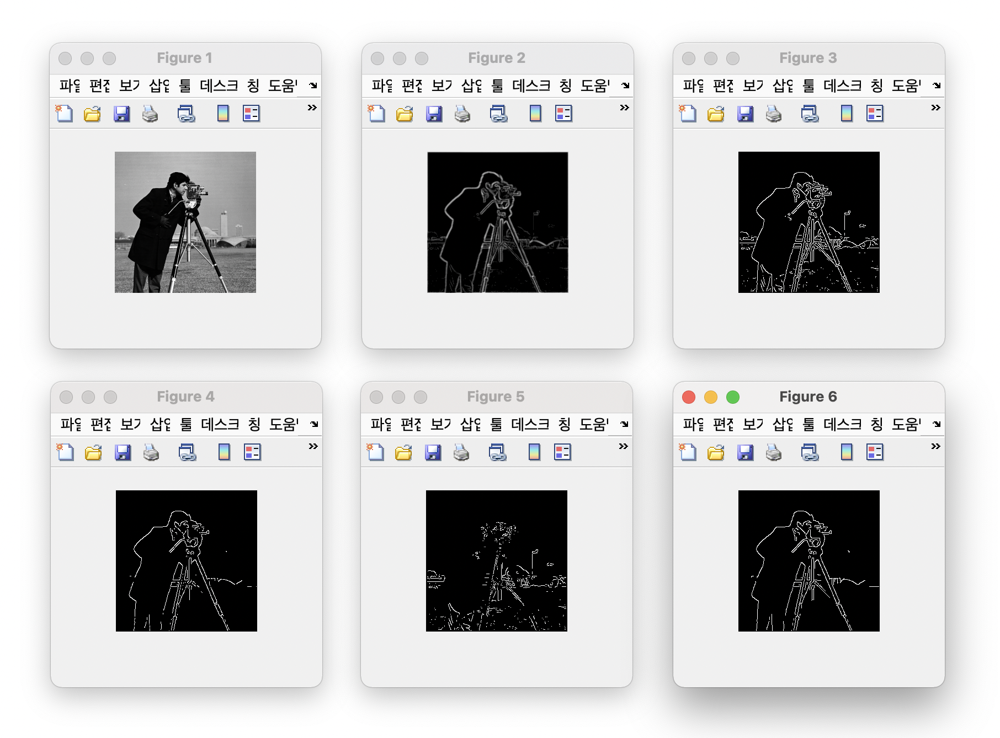

### Canny Edge Detection

- **Step 1.** Grayscale Conversion
- **Step 2.** Gaussian Blur
- **Step 3.** Compute Gradient Magnitude
- **Step 4.** Non Maximum Suppression
- **Step 5.** Double Thresholding
- **Step 6.** Edge Tracking by Hysteresis

 

- `img` : grayscaled original image
- `Img_edge` : gradient magnitude
- `Img_orient`: gradient orientation(direction)
- `Edge_direction`: edge direction (perpendicular to the gradient orientation)
- `Img_edgeThin` : thin edges created after step 4
- `Img_edgeStrong` : strong edges created after step 5
- `Img_edgeWeak` : weak edges created after step 5
- `Img_edgeStrong(update)` : strong edges updated after step 6
