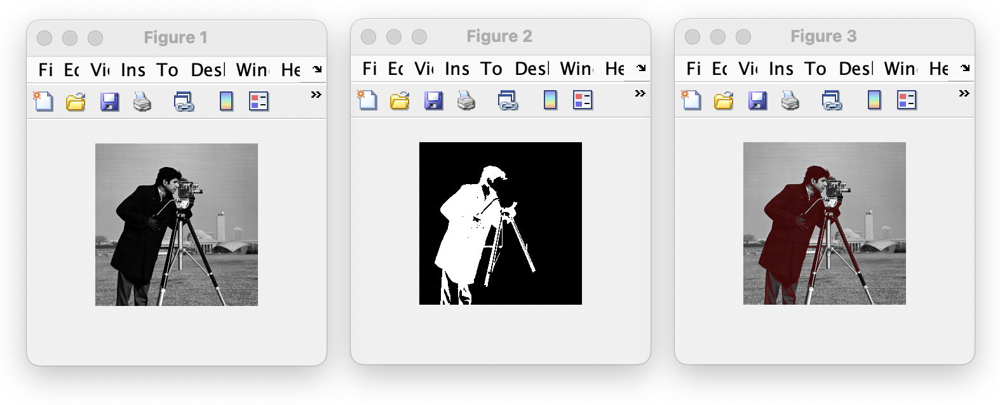

### Region Growing Image Segmentation

- **Step 1.** Initialize seed and travarseImg with a selected seed point
- **Step 2.** Select the first entry & For all 8 connected neighbor pixels, check:
  1) whether the current boundary pixel and neighbor pixel's gray value difference is lower than segTh
  2) whether the original seed pixel and neighbor pixel's grayscale value difference is lower than segThSeed
  - if so, add neighbor pixel into the segmented region and add it at the end of the seed
- **Step 3.** Remove the first entry from seed
- **Step 4.** Continue Step 2 and 3 as long seed is not empty

 

- `segTh` : threshold for boundary pixels
- `segThSeed` : threshold for original seed pixel
- `seed`: list variable that grows within the algorithm
- `seedVal` : initial seed gray value
- `travarseImg` : binary image (1 = segmented region / 0 = background)

