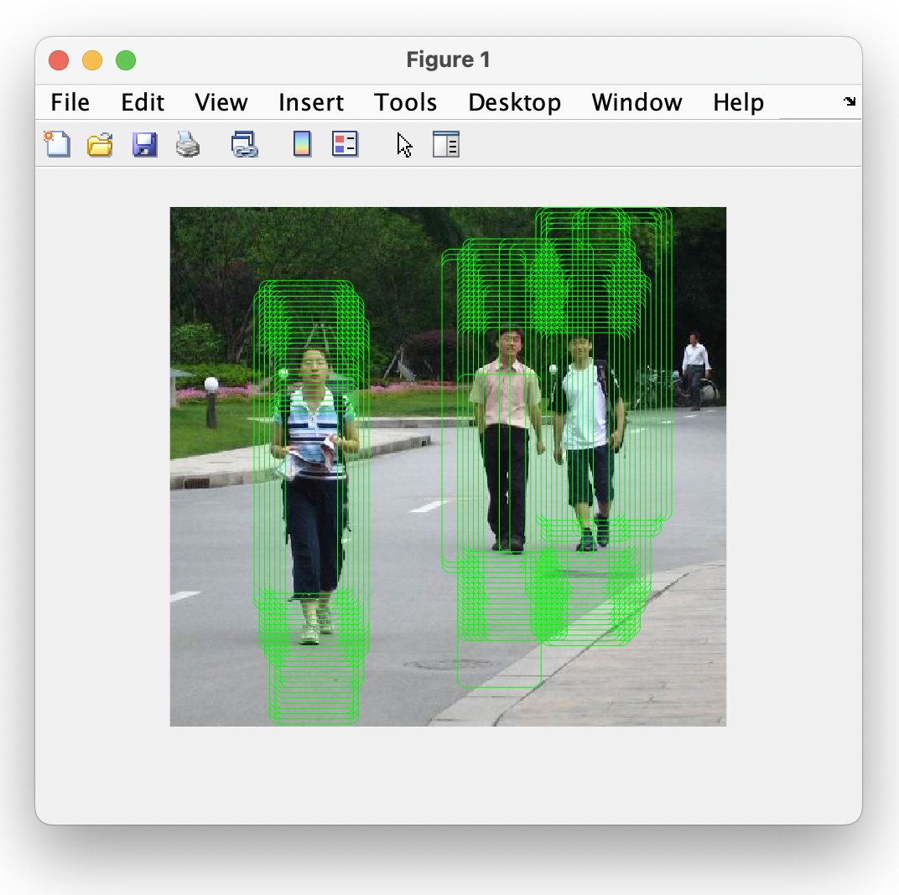

### Person Detection using HOG features

  

1. `dataPreparation` : load masks & images, crop person image & no-person image
2. `classifierTraining` : load person & no-person images, extract HOG features, do 10 fold cross validation
3. `classifierTesting`: load test image, test the classifier using sliding window

 

- `PedMasks` : folder that has masks
- `PNGImages` : folder that has images
- `croppedResizedImages`: folder where person images are stored after data preparation
- `noPersonImages`: folder where no-person images are stored after data preparation
- `testData`: folder that has test image

 

[download PedMasks & PNGImages folders](https://drive.google.com/drive/folders/1GkJ6Ush93wTGvwzQvTZdxwBYeyHGMuTZ?usp=sharing )
